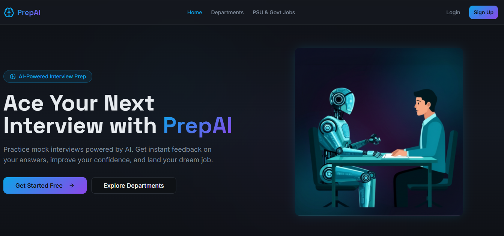

# PrepAI 
**PrepAI** is a web-based interview preparation platform designed to help users practice for **Technical, PSU, and Government job interviews**. The platform allows users to select their department (such as CSE, ECE, etc.) and explore different job roles related to that department, making interview preparation more structured and targeted.

---
### Homepage

### Technolgies Used
- HTML
- CSS
- JavaScript
- React
  
### 🚀 Features
- Department-based interview preparation (CSE, ECE, etc.)
- Role-based interview categories for each department
- Responsive and user-friendly interface
- Dynamic navigation between departments and roles
- Interactive UI built with reusable React components
